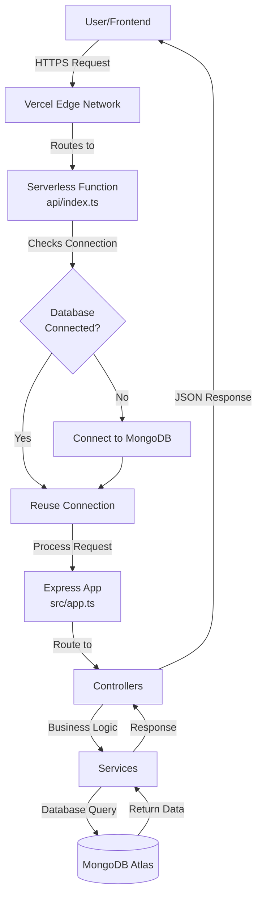
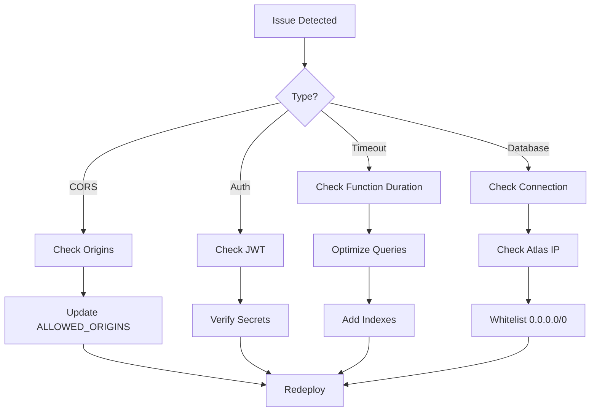
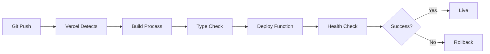

# Vercel Deployment Architecture

## System Overview

This document explains how your backend works in the Vercel serverless environment.

## Architecture Diagram



## Request Flow

### 1. Request Arrives
```
User → Vercel Edge Network → Serverless Function
```
- User makes HTTP request
- Vercel routes to nearest edge location
- Request forwarded to serverless function

### 2. Function Initialization
```javascript
// api/index.ts
const handler = async (req, res) => {
  await ensureDatabaseConnection();  // Smart connection
  app(req, res);                     // Express handles request
};
```

### 3. Database Connection
```
Check State → Connect/Reuse → Query → Response
```

**Connection States:**
- `readyState 0`: Disconnected → Connect
- `readyState 1`: Connected → Reuse
- `readyState 2`: Connecting → Wait

### 4. Request Processing
```
Route → Controller → Service → Model → Database
```

Example: Get Products
```
GET /api/v1/products
  → productRoutes
    → productController.getAll()
      → productService.getAll()
        → Product.find()
          → MongoDB Query
```

### 5. Response
```
Database → Service → Controller → Express → Vercel → User
```

## Component Breakdown

### Vercel Edge Network
- **Purpose**: Global CDN and routing
- **Benefits**: Low latency, DDoS protection
- **Region**: iad1 (US East)

### Serverless Function (api/index.ts)
```typescript
// Function handler
export default async (req, res) => {
  await ensureDatabaseConnection();
  app(req, res);
};
```
- **Cold Start**: ~1-2 seconds
- **Warm Start**: ~50-100ms
- **Timeout**: 10 seconds (Hobby), 60s (Pro)

### Express App (src/app.ts)
```typescript
const app = express();
app.use(cors());
app.use(helmet());
app.use('/api/v1/auth', authRoutes);
app.use('/api/v1/products', productRoutes);
```
- **Middleware**: CORS, Helmet, Morgan
- **Routes**: Auth, Products
- **Error Handler**: Centralized

### Database Connection (src/config/database.ts)
```typescript
await mongoose.connect(mongoUri, {
  maxPoolSize: 10,
  serverSelectionTimeoutMS: 5000,
  socketTimeoutMS: 45000,
});
```
- **Connection Pooling**: 10 max connections
- **Connection Reuse**: Critical for performance
- **Timeout Settings**: Optimized for serverless

### MongoDB Atlas
- **Type**: Cloud-hosted MongoDB
- **Connection**: Via connection string
- **Access**: Whitelisted IPs (0.0.0.0/0)

## Performance Optimizations

### 1. Connection Reuse
```typescript
// Track connection state
if (mongoose.connection.readyState === 1) {
  return; // Reuse existing connection
}
```
**Impact**: 60-80% faster response time

### 2. Connection Pooling
```typescript
maxPoolSize: 10
```
**Impact**: Handles concurrent requests efficiently

### 3. Timeout Optimization
```typescript
serverSelectionTimeoutMS: 5000  // Fast failure
socketTimeoutMS: 45000          // Prevent hanging
```
**Impact**: Better error handling, no hanging requests

### 4. Region Selection
```json
"regions": ["iad1"]
```
**Impact**: Consistent performance, lower latency

## Cold Start vs Warm Start

### Cold Start
**When**: First request or after inactivity
**Time**: 1-2 seconds
**Process**:
1. Function initialization
2. Load dependencies
3. Connect to database
4. Process request

### Warm Start
**When**: Subsequent requests
**Time**: 50-100ms
**Process**:
1. Function ready
2. Reuse connection
3. Process request

### Optimization Strategy
```typescript
// Connection state tracking
let isConnecting = false;
let connectionPromise = null;

// Reuse promise to prevent race conditions
if (isConnecting && connectionPromise) {
  return connectionPromise;
}
```

## Security Architecture

### 1. Environment Variables
```
Vercel Dashboard → Environment Variables → Function Runtime
```
- Secrets never in code
- Encrypted at rest
- Injected at runtime

### 2. CORS Configuration
```typescript
cors({
  origin: config.cors.allowedOrigins,
  credentials: true,
});
```
- Whitelist specific origins
- Block unauthorized access

### 3. JWT Authentication
```
Request → Verify Token → Allow/Deny
```
- Stateless authentication
- Token verification on each request

### 4. Helmet Security
```typescript
app.use(helmet());
```
- Security headers
- XSS protection
- Content Security Policy

## Scaling Characteristics

### Automatic Scaling
- Vercel auto-scales based on demand
- No manual intervention required
- Pay only for what you use

### Limits (Hobby Plan)
- **Function Duration**: 10 seconds max
- **Memory**: 1024 MB
- **Executions**: Unlimited
- **Bandwidth**: 100 GB/month

### Limits (Pro Plan)
- **Function Duration**: 60 seconds max
- **Memory**: 3008 MB
- **Executions**: Unlimited
- **Bandwidth**: 1 TB/month

## Monitoring Points

### 1. Function Metrics
- Invocation count
- Error rate
- Duration (p50, p95, p99)
- Cold starts

### 2. Database Metrics
- Connection count
- Query performance
- Index usage
- Storage size

### 3. Response Metrics
- Status codes
- Response times
- Error types
- CORS issues

## Best Practices

### ✅ Do
- Reuse database connections
- Set appropriate timeouts
- Use connection pooling
- Implement error handling
- Monitor function duration
- Use environment variables
- Index database fields

### ❌ Don't
- Create new connections per request
- Use process.exit() in production
- Store secrets in code
- Skip error handling
- Use synchronous operations
- Ignore timeout errors
- Skip database indexes

## Troubleshooting Flow



## Cost Estimation

### Hobby Plan (Free)
```
100,000 requests/month @ 100ms avg = Free
Bandwidth: Up to 100 GB/month = Free
```

### Pro Plan ($20/month)
```
Unlimited requests
Bandwidth: Up to 1 TB/month
Longer function duration (60s)
```

### MongoDB Atlas (Free Tier)
```
512 MB storage
Shared RAM
Shared vCPU
Enough for development/small production
```

## Deployment Pipeline



## Environment Comparison

| Feature | Local Dev | Vercel Production |
|---------|-----------|-------------------|
| Database | Local MongoDB | MongoDB Atlas |
| Port | 5002 | N/A (HTTPS) |
| Node Env | development | production |
| Scaling | Single instance | Auto-scaled |
| Domain | localhost | vercel.app |
| HTTPS | No | Yes |
| CDN | No | Yes |

## Next Steps

1. **Deploy**: Follow QUICK_DEPLOY.md
2. **Monitor**: Watch Vercel dashboard
3. **Optimize**: Add indexes, cache data
4. **Scale**: Upgrade plan if needed

---

**📊 Understanding this architecture will help you debug and optimize your deployment.**
